# Övningsuppgifter — Elinstallation

Index över övningsuppgifterna till *Faktabok* och *Montörshandbok* för kursen
Elinstallation. Frågorna behåller sin numrering från käll-PDF:en, så att
"fråga 142" betyder samma sak här som i original och i klassrummet.

| | |
|---|---|
| Källa | [`Övningsuppgifter Montörshandbok och Faktabok.pdf`](Övningsuppgifter%20Montörshandbok%20och%20Faktabok.pdf) |
| Antal frågor | 279 |
| Del A | Fråga 1–219, grupperade per kapitel. Fråga 73 är ett offert-case med sju delfrågor (73.1–73.7). |
| Del B | Fråga B1–B53 om Elinstallationsreglerna SS 436 40 00. |

> Filen är genererad. Ändra i `fragor.json` och kör `python3 verktyg/generera_index.py`.

## Innehåll

- [Faktabok kapitel 1](#faktabok-kapitel-1) — fråga 1–12 (12 st), s. 1
- [Faktabok kapitel 2](#faktabok-kapitel-2) — fråga 13–27 (15 st), s. 3
- [Faktabok kapitel 3 + Montörshandbok kapitel 3](#faktabok-kapitel-3--montörshandbok-kapitel-3) — fråga 28–47 (20 st), s. 5
- [Faktabok kapitel 4](#faktabok-kapitel-4) — fråga 48–57 (10 st), s. 8
- [Faktabok kapitel 5 + Montörshandbok kapitel 4 och 1](#faktabok-kapitel-5--montörshandbok-kapitel-4-och-1) — fråga 58–82 (32 st), s. 10
- [Faktabok kapitel 6 och 7 + Montörshandbok kapitel 2](#faktabok-kapitel-6-och-7--montörshandbok-kapitel-2) — fråga 83–102 (20 st), s. 14
- [Faktabok kapitel 8](#faktabok-kapitel-8) — fråga 103–116 (14 st), s. 17
- [Faktabok kapitel 9 + Montörshandbok kapitel 5](#faktabok-kapitel-9--montörshandbok-kapitel-5) — fråga 117–146 (30 st), s. 19
- [Faktabok kapitel 10 + Montörshandbok kapitel 5](#faktabok-kapitel-10--montörshandbok-kapitel-5) — fråga 147–156 (10 st), s. 24
- [Faktabok kapitel 11 + Montörshandbok kapitel 2](#faktabok-kapitel-11--montörshandbok-kapitel-2) — fråga 157–168 (12 st), s. 26
- [Faktabok kapitel 12 + Montörshandbok kapitel 1](#faktabok-kapitel-12--montörshandbok-kapitel-1) — fråga 169–177 (9 st), s. 29
- [Faktabok kapitel 13 + Montörshandbok kapitel 3](#faktabok-kapitel-13--montörshandbok-kapitel-3) — fråga 178–189 (12 st), s. 31
- [Faktabok kapitel 14 + Montörshandbok kapitel 6](#faktabok-kapitel-14--montörshandbok-kapitel-6) — fråga 190–204 (15 st), s. 33
- [Faktabok kapitel 15 + Montörshandbok kapitel 6](#faktabok-kapitel-15--montörshandbok-kapitel-6) — fråga 205–219 (15 st), s. 38
- [Elinstallationsreglerna SS 436 40 00](#elinstallationsreglerna-ss-436-40-00) — fråga B1–B53 (53 st), s. 40

## Faktabok kapitel 1

#### 1. Vilka instrument ser du på bilderna?

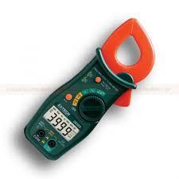

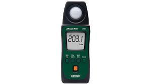

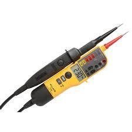

s. 1 i PDF:en

#### 2. Vad ska du tänka på när du använder stegar? Vilken säkerhet gäller.

s. 1 i PDF:en

#### 3. Vilken personlig utrustning (kläder mm) behöver du för att få arbeta på en större arbetsplats idag?

s. 1 i PDF:en

#### 4. Vem kommer att utfärda ditt elcertifikat när du är klar med din utbildning?

s. 1 i PDF:en

#### 5. Hur lång tid tar det för dig att bli en fullbetald elektriker?

s. 1 i PDF:en

#### 6. Du har fått en arbetsorder att felsöka hos en privatperson. Deras värmegolv fungerar inte och golvet är iskallt. Hur gör du din felsökning och vilka instrument behöver du?

s. 1 i PDF:en

#### 7. Du skall göra ett 20mm hål i en tegelvägg för en kabelgenomgång. Vilken utrustning behöver du då?

s. 2 i PDF:en

#### 8. Vad använd en regelsökare för?

s. 2 i PDF:en

#### 9. Vad heter verktygen nedan?

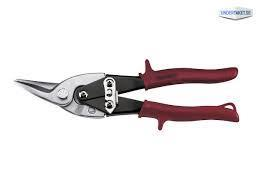

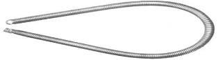

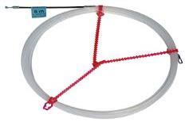

s. 2 i PDF:en

#### 10. Vilka regler finns för att få köra en Saxlift? (Google fråga)

s. 2 i PDF:en

#### 11. I din yrkesroll kommer du inte enbart att installera. Du kommer att ha mänga andra roller också. Ge exempel på några sådana roller

s. 2 i PDF:en

#### 12. Elbranschen rekommenderar att elföretagen använder branschens checklista när lärlingar nyanställs. Skriv ned vilka punkter som tas upp. Checklistan hittar du på www.ecy.com.

s. 3 i PDF:en

## Faktabok kapitel 2

#### 13. En kund beställer ett arbete hos ett medelstort elföretag. Hur kan arbetsgången se ut?

s. 3 i PDF:en

#### 14. Du ska skriva din första tidsedel. Vilka uppgifter vill din arbetsgivare ha?

s. 3 i PDF:en

#### 15. Vilka på företaget brukar beräkna kostnaderna för ett elarbete?

s. 3 i PDF:en

#### 16. En kund beställer ett arbete av ett elföretag. Kostnaden är säkert det första som diskuteras. Men det kan finnas andra faktorer som också kan avgöra om elföretaget får jobbet. Vilka?

s. 3 i PDF:en

#### 17. Innan du åker ut till en kund, bör du planera ditt arbete. Varför?

s. 3 i PDF:en

#### 18. Sök i montörshandboken var du ska placera diskmaskinsuttaget i ett kök.

s. 3 i PDF:en

#### 19. Vad innebär att ”elinstallationen skall utföras enligt Svensk Standard”?

s. 3 i PDF:en

#### 20. Hur översätts kabeltypen EXQJ 4x10/10 till dagens kabelmärkningssystem? Vad betyder bokstäverna?

s. 4 i PDF:en

#### 21. Vad innebär det att göra en riskanalys?

s. 4 i PDF:en

#### 22. Vilka/vad bestämmer om en armatur får monteras i ett visst utrymme?

s. 4 i PDF:en

#### 23. Materialkännedom. Vilka två företag är störst på Svenska marknaden för tillverkning av strömbrytare och vägguttag i våra hem? (Google)

s. 4 i PDF:en

#### 24. Vilka arbetsuppgifter har nedanstående personer på ett elföretag? (Google) Kalkylator? Administratör? Offertansvarig? Projektledare? Ledande montör? Projektingenjör? Projektör? Filialchef?

s. 4 i PDF:en

#### 25. Hur går du tillväga för att montera ett vägguttag på en vägg med (se nedan). Vilka verktyg och material behövs? - Dubbel gips - Betongvägg - Tegelvägg - Enkelgips

s. 5 i PDF:en

#### 26. Vad betyder ATL?

s. 5 i PDF:en

#### 27. Vad är det för skillnad på en sockeldosa och en apparatdosa vid installationer av vägguttag?

s. 5 i PDF:en

## Faktabok kapitel 3 + Montörshandbok kapitel 3

#### 28. Du skall montera en apparatdosa invid en dörrpost i ett regelverk. Det ska monteras extra breda dörrfoder. Vad måste du som elektriker tänka på så att inte apparatdosa kommer mitt i dörrfodret.

s. 5 i PDF:en

#### 29. Varför är det viktigt att fästa rören ordentligt i regelverken?

s. 5 i PDF:en

#### 30. Vad ska du tänka på om det är 21 meter mellan centralen och vägguttaget i en infälld installation?

s. 5 i PDF:en

#### 31. Hur ska man skydda ett ledningssystem som förläggs fritt i väggen, t.ex. när kabeln dras den kortaste vägen?

s. 5 i PDF:en

#### 32. Du har lagt en mängd rör och dosor på ett valv. Varför är det väldigt viktigt att du har najat rören ordentligt och satt fast doserna med spik?

s. 5 i PDF:en

#### 33. Förklara vilka fördelar och nackdelar med VP-röret, om du jämför med slang.

s. 6 i PDF:en

#### 34. Kabeln till en spis skall vara 5st FK 2,5mm². Vilken storlek på VP rör ska du välja?

s. 6 i PDF:en

#### 35. Då du arbetar i ett regelverk av plåt, kan du inte spika fast dina dosor. Vilken fästmetod kan du då använda dig av?

s. 6 i PDF:en

#### 36. Nedan ser du två typer av vanliga toppklämmor (Torix och Wago). a) Hur många 1,5mm² ledare får anslutas i en Torix T6 b) Hur mycket ska varje kabel skalas av för att ge en säker koppling enligt tillverkarna?

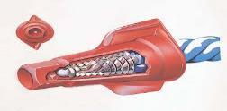

s. 6 i PDF:en

#### 37. Ange diametern på en, Apparatdosa………………Kopplingsdosa……………. Armaturdosa……………

s. 6 i PDF:en

#### 38. Ange de vanligaste diametern på VP-rör / slang, 1……………………….. 2…………………… 3………………………

s. 6 i PDF:en

#### 39. Hur kan man förhindra elektriska och magnetiska fält vid infälld installation? Elektriska fält…………………………………………………………………………………………… Magnetiska fält………………………………………………………………………………………

s. 6 i PDF:en

#### 40. Nämn sex verktyg / hjälpmedel som är förknippade med en infälld installation, 1………………………………… 2……………………………… 3…………………………….. 4……………………………….. 5……………………………… 6……………………………..

s. 7 i PDF:en

#### 41. Vad bör du tänka på vid rörförläggning med tanke på placering av rören och kondensrisk? Placering………………………………………………………………………………………………….. Kondens……………………………………………………………………………………………………

s. 7 i PDF:en

#### 42. Vilken beteckning har en el-ritning som visar, Kraft/belysning…………………………….. Telesystem……………………………..

s. 7 i PDF:en

#### 43. En central är märkt A1N5+R507, vad betyder denna märkning?

s. 7 i PDF:en

#### 44. Se bifogad ritning. Ange antal ledare som du behöver i rören, streck är fas-tändtråd-mellantråd, streck med prick är nolla, streck med tvärstreck är skyddsjord. I högerspalten anger du mått och IP-klasser. (se bifogad ritning)

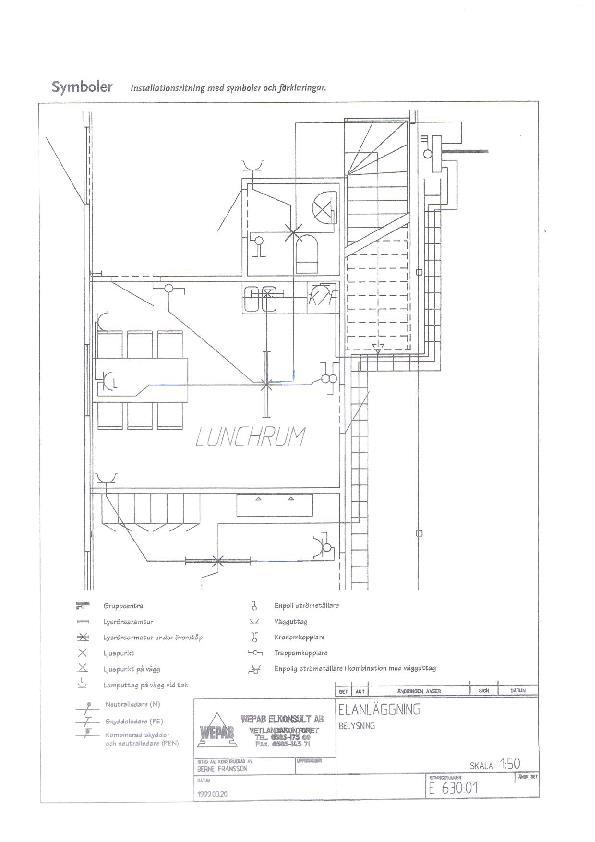

s. 7 i PDF:en

#### 45. Väggar i en byggnad skall antingen enklas eller dubblas, vad innebär detta och vad måste du som elektriker tänka på?

s. 7 i PDF:en

#### 46. En byggnad består av en grundläggning, stomme, bjälklag och tak. Beskriv några olika grundläggningar, vad menas med bjälklag och vad är en takstol? Grundläggning 1………………………… 2……………………… 3…………………………….. Bjälklag är …………………………………………………………………………………….. Takstol är ……………………………………………………………………………………….

s. 8 i PDF:en

#### 47. Vad betyder de här beteckningarna på en ritning? E: A: K: BR: S:

s. 8 i PDF:en

## Faktabok kapitel 4

#### 48. Vad betyder begreppet ROT?

s. 8 i PDF:en

#### 49. Du skall bila in rör och dosor i en lättbetongvägg. Vilken personlig skyddsutrustning ska du använda då?

s. 8 i PDF:en

#### 50. En elinstallation finns inritad på en planritning. I vilken enhet anges alla mått?

s. 8 i PDF:en

#### 51. Räkna om skalor samt måttsätt på den bifogade ritningen över Lunchrum.

- Hur många centimeter är en meter vid en skala på 1:10
- Hur många centimeter är en meter vid en skala på 1:25
- Hur många meter kabelstege är det
- Mät upp längden på väggarna i Lunchrummet och beräkna kvadrat ytan.

s. 9 i PDF:en

#### 52. En byggnads grundläggning kan utföras på olika sätt. Nämn tre olika sätt.

s. 9 i PDF:en

#### 53. Vad kallas golvet och taket på fackmannamässigt språk?

s. 9 i PDF:en

#### 54. Vad innebär begreppet bärande vägg? Och vilka konsekvenser kan det få om man river ned den?

s. 9 i PDF:en

#### 55. Vad är den vanligaste tjockleken på en gipsskiva?

s. 9 i PDF:en

#### 56. Hur kunde ledarnas färger i en elanläggning se ut:

- Före 70 talet?
- Mellan 1970-2002?

s. 9 i PDF:en

#### 57. Vad ska man tänka på vid installationer av apparatdosor för att undvika ljudspridning?

s. 9 i PDF:en

## Faktabok kapitel 5 + Montörshandbok kapitel 4 och 1

#### 58. Namnge lämplig kabel i följande miljöer: Klamrad på utomhusfasad……………………….. Installation av vägguttag i sovrum………………. Nedgrävd i mark mellan tex garage och huvudbyggnad…………………. Installation i garage…………………….. Kontorsinstallation där kabeln delvis går på stege / i ränna, delvis i rör ovan undertak………………….. Förläggning i ellist / kontorskanal ……………………

s. 10 i PDF:en

#### 59. Vid utanpåliggande installation av kabel måste du se till att risken för kallflytning elimineras. Vad skall du tänka på?

s. 10 i PDF:en

#### 60. Vad bör du tänka på vid klamring av kabel på vägg? 1………………………………………………………………………………………………………….. 2………………………………………………………………………………………………………….. 3…………………………………………………………………………………………………………..

s. 10 i PDF:en

#### 61. Vid klamring mot betong / tegel behöver du plugga. Vilken borrstorlek passar till: Gul plugg…………………. Röd plugg …………… Brun plugg……………..

s. 10 i PDF:en

#### 62. Vid uppsättning av apparater i gips / betong / lättbetong / tegel krävs mer än bara en skruv. Namnge lämplig montageprodukt för följande typer av material. Uppsättning på gipsvägg…………………………………………………………………….. Uppsättning i betong tak……………………………………………………………………… Uppsättning i lättbetong …………………………………………………………………….. Uppsättning i tegelvägg……………………………………………………………………….

s. 11 i PDF:en

#### 63. Varför skall tele / data kabel vara åtskilda i en egen ränna när de förläggs på kabelstege?

s. 11 i PDF:en

#### 64. Vad är skillnaden mellan brandspridningsklass F2 och F4?

s. 11 i PDF:en

#### 65. Ett av företagen som tillverkar produkter för brandtätningar heter FireSeal. Nämn minst fyra olika brandtätningar som företaget tillverkar.

s. 11 i PDF:en

#### 66. En av FireSeals brandtätningar har samma dimensioner som ett vanligt VP-rör. Vad heter den?

s. 11 i PDF:en

#### 67. Vad ska du tänka på när du installerar armaturer på en vajer (lina) som du har spänt upp?

s. 11 i PDF:en

#### 68. En kabel som kommer upp ur ett markrör måste skyddas mekaniskt. Hur högt skall detta skydd nå över marken?

s. 11 i PDF:en

#### 69. En brandcell i en byggnad som klassas EI60 skall stå emot / ej sprida, rök eller brand inom 60min. Hur kan man göra kabel genomföringar brandtäta?

s. 11 i PDF:en

#### 70. Halogenfri kabel är idag vanligast. Bokstaven K som stod för PVC har ersatts av Q. Vilka är fördelarna med halogenfri kabel?

s. 11 i PDF:en

#### 71. Beskriv skillnaden mellan följande värmekablar: Serie-resistiv…………………………………………………………………………………………… Parallell-resistiv …………………………………………………………………………………….. Självbegränsande……………………………………………………………………………………..

s. 12 i PDF:en

#### 72. Serie-resistiv värmekabel tillverkas med en effekt på 10W/m kabel. Om du skall lägga ett värmegolv för uppvärmning av rummet samt comfort bör du installera ca 100W/m2. Hur lång kabel skall du köpa till ett 8m2 stort badrum? ………………………. Hur stort c/c avstånd mellan slingorna blir det……………………… Innan / efter förläggning / efter golvbeläggning skall isolationsprov och resistansmätning av slingan göras, allt skall dokumenteras. Hur stor bör resistansen i din kabel vara ( vi antar 230V anslutnings spänning )?

s. 12 i PDF:en

#### 73. Du kommer till ett kund som vill installera värmekabel i sitt badrum på 8 kvadrat. Du föreslår T-Blå 100W/m2 som värmekabel. Kunden vill ha en offert av dig innan arbetet kan påbörjas. Du räknar med att det kommer att behövas 3st besök innan arbetet är klart och en arbetstid på 6 timmar. Moms och rotavdrag på arbetstid ska redovisas på offerten. Dina kostnader är: Arbetstid = 540kr/tim. Bilkostnad = 600kr/tillfälle Värmekabel =730kr/m2 Moms 30 % ROT-avdrag 25 %

s. 12 i PDF:en

#### 73.1. Hur kommer din offert se ut?

s. 12 i PDF:en

#### 73.2. Vilka mätningar och när ska du göra när du har installerar ett värmegolv?

s. 12 i PDF:en

#### 73.3. Vad ska man tänka på när det gäller givarkabeln?

s. 12 i PDF:en

#### 73.4. Vad skall man tänka på när man räknar ut hur mycket kabel som kommer att gå åt?

s. 12 i PDF:en

#### 73.5. Räkna ut den totala effekten för värmegolvet om effekten för kabeln är 12w/m

s. 12 i PDF:en

#### 73.6. Räkna ut hur stor ström den tar och vilken säkring du skall välja.

s. 12 i PDF:en

#### 73.7. Räkna ut vilket ohmvärdet för värmegolvet

s. 12 i PDF:en

#### 74. Ta fram en materialkatalog eller gå in på någon elleverantörs hemsida och leta upp E-nummer för följande produkter:

- Kopplingsdosa Eljo 85x85mm
- Strömbrytare trapp/1polig Schneider Exxact
- EXQ-Pure 3g1,5 Draka
- VP rör 16mm halogenfri
- Säkerhetsbrytare Bas16 från ABB

s. 13 i PDF:en

#### 75. Identifiera fästelementen på figurerna nedan

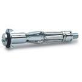

s. 13 i PDF:en

#### 76. Beskriv användningsområde för en clipsplugg och skruvplugg

s. 13 i PDF:en

#### 77. I vilka lokaler ska det finnas nödbelysning?

s. 13 i PDF:en

#### 78. Av vilka skäl monteras nödbelysning?

s. 13 i PDF:en

#### 79. Det finns en viktig regel du måste följa då du använder plastplugg. (Här gäller det skruven) Hur lyder den?

s. 14 i PDF:en

#### 80. Du ska montera en LED armatur 28 W i ett betongtak. Vilken fästmetod är lämpligast att använda då?

s. 14 i PDF:en

#### 81. Kabelbeteckningen på en EQLQ kan vara 3x1,5 eller 3G1,5. Vad betyder dessa siffror och bokstäver?

- 3
- 1,5
- G
- X

s. 14 i PDF:en

#### 82. Var hittar du uppgifter om var eluttagen skall placeras i ett kök? telefonen ska vara väggmonterad. 1500 ?

- Vilket mått gäller för ett spisuttag
- Var ska diskmaskinsuttaget placeras och vilken höjd
- Vilken höjd ska uttaget för kylskåp placeras
- Ska det vara enkelt eller dubbelt uttag för en platsbunden apparat
- Vid ett uttag för telefon eller TV skall det också monteras ett annat uttag. Vilket?
- På vilken höjd över golvet ska ett uttag för väggfast telefon placeras i ett kök, då
- Om det tex. Står att ett uttag ska monteras 1500 ög. Var på uttaget tas måttet

s. 14 i PDF:en

## Faktabok kapitel 6 och 7 + Montörshandbok kapitel 2

#### 83. Vad innebär kvalitet, när det handlar om elinstallationer?

s. 14 i PDF:en

#### 84. Vilka fördelar finns det med att arbeta kvalitetssäkrat?

s. 14 i PDF:en

#### 85. EIO har ett eget kvalitetssäkringssystem. Vad heter det?

s. 15 i PDF:en

#### 86. Det finns ett dokument som elmontören kan använda vid sina egenkontroller. Vad kallas det?

s. 15 i PDF:en

#### 87. När ska en avikelserapport användas?

s. 15 i PDF:en

#### 88. Du ska se till att elmaterial som ska skrotas, tas om hand på ett miljöriktigt sätt. Vem har beslutat att det ska vara så?

s. 15 i PDF:en

#### 89. Vem har huvudansvaret för att du har en bra arbetsmiljö?

s. 15 i PDF:en

#### 90. Facket och arbetsgivarna har skapat en organisation, ETAK; som tar fram material och regler, för säkrare arbetsmiljö för elektriker. Vilka fackliga organisationer ingår i ETAK?

s. 15 i PDF:en

#### 91. Vilka mål och uppgifter har ETAK?

s. 15 i PDF:en

#### 92. Vad är ett skyddsombud och vilka uppgifter har den?

s. 15 i PDF:en

#### 93. Det finns många faktorer som påverkar den psykosociala arbetsmiljön. Nämn tre faktorer.

s. 15 i PDF:en

#### 94. Varför är det så viktigt att göra en tillbudsrapport?

s. 15 i PDF:en

#### 95. Vad kan du göra för att undvika fallolycker?

s. 15 i PDF:en

#### 96. Vid vilket gränsvärde för buller bör du använda hörselskydd, om du utsätts för det under en längre tid? Vad innebär hörselskydd med medhörning?

s. 15 i PDF:en

#### 97. Vad heter regelverket som behandlar skötselåtgärder om el?

s. 16 i PDF:en

#### 98. Sök efter svar till följande uppgifter på Arbetsmiljöverkets hemsida www.av.se

- Stegar, ställningar: Vid vilken höjd måste det finnas räcke på en ställning?
- Personlig utrustning: Vilka personliga skyddsutrustningar anser du vara viktigast?
- Minderåriga: Får en 17 årig elev arbeta mellan klockan 01.00-05.00?
- Vad krävs för att få ett arbetstillstånd i Sverige?
- Skyddsombud: Vem utser ett skyddsombud?

s. 16 i PDF:en

#### 99. Vad innebär det att arbeta enligt ISA?

s. 16 i PDF:en

#### 100. Vad kontrollerar du vid en kontinuitetstest? Vilket mätinstrument använder du? Hur går mätningen till? Vad är lämpligt värde i en normalstor anläggning?

s. 16 i PDF:en

#### 101. Vad kontrollerar du med ett isolationstest? Vilket mätinstrument använder du? Vilken testspänning krävs vid kontroll av en 400/230V anläggning? Vad är ett godkänt värde?

s. 17 i PDF:en

#### 102. Efter dessa kontroller kan du spännings sätta anläggningen och utföra ett jordfelsbrytartest. Vilket instrument använder du? Hur utför du kontrollen? Vilket värde skall en jordfelsbrytare för personskydd bryta vid………………… Inom vilken tid ……………………. Vilket värde skall en jordfelsbrytare för brandskydd bryta vid…………………

s. 17 i PDF:en

## Faktabok kapitel 8

#### 103. Beskriv de två olika entreprenadformerna Generalentreprenad och Totalentreprenad.

s. 17 i PDF:en

#### 104. Varför gör man en tidsplan för större och mindre arbeten?

s. 18 i PDF:en

#### 105. Vad diskuteras på de byggmöten som hålls i samband med ett större arbete?

s. 18 i PDF:en

#### 106. Till ett större arbete görs en rambeskrivning. Vem gör den?

s. 18 i PDF:en

#### 107. Elritningar har olika nummer beroende på vilken typ av anläggning som finns på ritningen. Förklara vilken typ av elanläggning som avses på följande ritningsnummer.

- 631
- 642
- 647
- 840

s. 18 i PDF:en

#### 108. Vad är en relationsritning och när upprättas den?

s. 18 i PDF:en

#### 109. Vem har ansvaret för de fel som eventuellt kan uppstå vid en elektrisk installation.

s. 18 i PDF:en

#### 110. Vad betyder förkortningen EL-AMA

s. 18 i PDF:en

#### 111. Förklara vad en gränsdragningslista har för funktion

s. 18 i PDF:en

#### 112. På en arbetsplats skrivs det alltid en dagbok. Varför är det viktigt?

s. 18 i PDF:en

#### 113. Det kan uppstå förseningar på ett bygge. Förseningar kostar pengar för beställare och entreprenör. Vad betyder vitesavgift och hur stor är den vanligtvis?

s. 18 i PDF:en

#### 114. Vad betyder det att vara utsedd till BAS-P och BAS-U?

s. 18 i PDF:en

#### 115. Vad är AB04 och ABT06 för regler? (Google)

s. 18 i PDF:en

#### 116. På ett bygge finns det massor av konsulter inblandade. Vad har elkonsulten för uppgift, ansvar och vem är hans arbetsgivare?

s. 18 i PDF:en

## Faktabok kapitel 9 + Montörshandbok kapitel 5

#### 117. Hur benämns de tre fasspänningar som vi har i vårt elsystem?

s. 19 i PDF:en

#### 118. Vad händer om du skiftar fasföljden vid en motorinstallation?

s. 19 i PDF:en

#### 119. Spänning system: Förklara skillnaden mellan ett IT-system och ett TN-system

s. 19 i PDF:en

#### 120. Var hittar du den informationen i SS 436 40 00?

s. 19 i PDF:en

#### 121. Det finns tre stycken TN-system. vilka?

s. 19 i PDF:en

#### 122. Beskriv hur spänningen förs från kraftverk till abonnent. Namnge näten, spänningsnivåerna och lednings namnen. Kraftverk ( vatten / ånga / vind ) driver en turbin som driver en generator på 20KV ( 400KV på gång ) direktkopplad till en transformator som höjer spänningen 20/400KV. Med hög spänning får vi ned strömmen vilket minskar spänningsförluster och effektförluster i överföringskablarna. I = P / U * cos^ * √3 Uförlust = ϱ * L * I * √3 / A Pförlust = I2 * Rledare 400KV överföringsspänning är vårt ……………..nät. När vi närmar oss bebyggelse transformerar vi ner till 400/130KV. 130KV nätet är vårt ……..……………nät. Det förekommer att 130KV transformeras till 70KV avsett för mindre områden typ Värmdö. Nätet kallas även då för ……………………………nät. Från 130KV transformatorn (130/20KV ) eller 70KV transformatorn (70/20KV ) utgår 20KV, detta nät kallas ………………………………..nät. 20KV nätet matar ett flertal nätstationer som transformerar spänningen till 20/0,4KV dvs 400V. Nätstation / Kabelskåp till serviscentral / mätarskåp ………………………….ledning. Mätarsäkring till gruppcentral ……………………………… ledning. Gruppcentral till apparat……………………………….. ledning. Systemspänningen i huset är…………..V och mäts mellan…………………………………. Fasspänningen i huset är…………….V och mäts mellan ………………………………………

s. 19 i PDF:en

#### 123. Vad blir systemspänningen / fasspänningen i en byggnads serviscentral om byggnaden matas med en FKKJ 3*120 / 70 från en nätstation, kabeln som är 180m lång antas belastas med 160A, antag 400/230V i nätstationen? Visa din lösning! U ……………………. Uf…………………..

s. 20 i PDF:en

#### 124. Rita ett förbindningsschema över en central med huvudbrytare, jordfelsbrytare, säkringar, nollskena och jordskena. Inkommande kabel EKKJ 4*6 /6.

s. 20 i PDF:en

#### 125. Rita ett förbindningsschema över en central med huvudbrytare, jordfelsbrytare, säkringar, nollskena och jordskena. Inkommande kabel FKKJ 3*16 / 16.

s. 20 i PDF:en

#### 126. Rita ett förbindningsschema över en central med huvudbrytare, jordfelsbrytare, säkringar, nollskena och jordskena. De tre första säkringarna som sköter värmepannan skall ej skyddas av jordfelsbrytaren. Inkommande kabel EKKJ 3*10 /10.

s. 20 i PDF:en

#### 127. Förklara skillnaden på inkopplingen av en äldre mätartavla avsedd för direktmätning jämfört med den nya mätartavlan med elektronisk mätare?

s. 20 i PDF:en

#### 128. När mätar/servis säkringar är över 63A skall strömtransformatorer kopplas in. Hur fungerar dessa?

s. 20 i PDF:en

#### 129. Din tvättmaskin 230V / 2000W används 4:a ggr / vecka. Varje tvätt tar ca 1 timme. Vad blir årskostnaden för att hålla kläderna rena? Energipris 1,25kr/kwh. Visa beräkningar. Årskostnad TM……………………………

s. 21 i PDF:en

#### 130. Hur stor blir din energikostnad om din äldre villa med direktverkande el har ett årligt energibehov på 25.000 kwh ( 20.000kwh värme + 5.000kwh övrigt ) och energipriset är 1,25kr/kwh? Energikostnad / år …………………………….

s. 21 i PDF:en

#### 131. Hur stor blir din energikostnad om din äldre villa byter värmesystem och installerar en bergvärmepump till vattenburen golvvärme. Värmepumpen beräknas dra ner dina värmekostnader med 70%. Energipriset är 1,25kr/kwh? Ny energikostnad / år ……………………….

s. 21 i PDF:en

#### 132. Beskriv vad som menas med potentialutjämning?

s. 21 i PDF:en

#### 133. Rita en överskådlig bild hur potentialutjämning går till och använd dig av rätt begrepp på ledarna / delarna. Ange även minsta area på ledarna. (separat papper)

s. 21 i PDF:en

#### 134. Vad är det som bestämmer din area på skyddsutjämningsledare till t.ex. en kabelstege i metall?

s. 22 i PDF:en

#### 135. Dags för spänningskontroll. Vilken spänning får du om du mäter mellan: L1-L2…………….. L3-N……………….. PE-N…………….. L2-PE………………..

s. 22 i PDF:en

#### 136. Beskriv fenomenet vagabonderande strömmar.

s. 22 i PDF:en

#### 137. Vad menas med begreppet potentialutjämning?

- Var hittar du den informationen i SS 436 40 00?

s. 22 i PDF:en

#### 138. Anslutningspunkt: anslutningspunkt. Vilken?

- Vad menas med uttrycket ”anslutningspunkt”
- Det finns en anledning till att man sammanför olika serviser till en

s. 22 i PDF:en

#### 139. Det finns två olika sätt att mäta kundernas elförbrukning. Vilka?

s. 22 i PDF:en

#### 140. Vilka av dessa metoder används när man mäter energin i en villa?

s. 22 i PDF:en

#### 141. Koppla in dessa mätartavlor med hjälp av pennan. Till vänster ser du ett 4-ledarsystem och till höger ett 5-ledar system.

- Ange vilka minimiareor som du använder
- Var hittar du den informationen i SS 436 40 00?
- Vilken tyd av kabel skall du koppla med
- Förklara varför det ska vara olika kabelareor

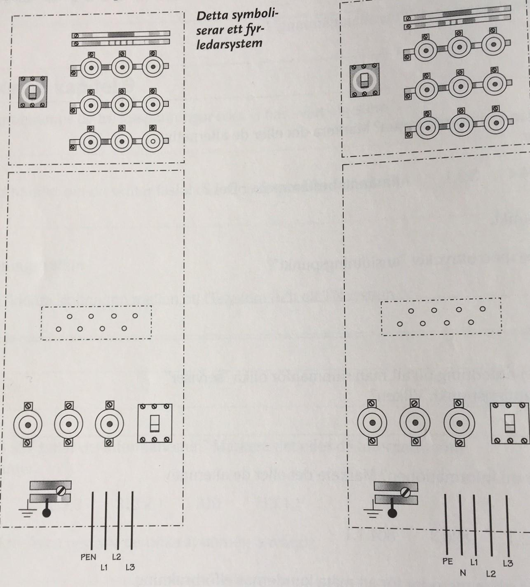

s. 22 i PDF:en

#### 142. Varför är det viktigt att alla 3-fasuttag eller maskiner har rätt fasföljd?

s. 23 i PDF:en

#### 143. Vad är en föranmälan? Nämn två exempel på vad som behöver utredas mellan Leverantör och Elföretag?

s. 24 i PDF:en

#### 144. När ska en för & Färdiganmälan göras om det krävs?

s. 24 i PDF:en

#### 145. I varje installation där skyddsutjämning används ska det finnas en huvudjordningsskena. Vilka ledare ska anslutas till den?

- Var hittar du den informationen i SS 436 40 00?

s. 24 i PDF:en

#### 146. Nämn tre objekt (föremål) som ska anslutas till huvudjordningsskenan

s. 24 i PDF:en

## Faktabok kapitel 10 + Montörshandbok kapitel 5

#### 147. Du har monterat upp en normcentral som även innehåller styrutrustning med extra givare. Givarna är färdig monterade med svagströmskabel (typ EKKX). Vad måste du göra med sådana kablar i centralen?

- Var hittar du den informationen i SS 436 40 00? 521.6, 705.1, 528.1.1, 515.2

s. 24 i PDF:en

#### 148. Du skall kapa fasskenorna till en normcentral. Det är viktigt att du kapar dem efter anvisningarna. Du måste även montera sidoskydd. Varför?

s. 24 i PDF:en

#### 149. Du ska montera en central i en lägenhet.

- Hur stort ska avståndet från golvet till centralen underkant vara?
- Varför bör man aldrig gömma en central under eller över hatthyllan?

s. 24 i PDF:en

#### 150. Skriv in namnen på de olika delarna i denna huvudcentral.

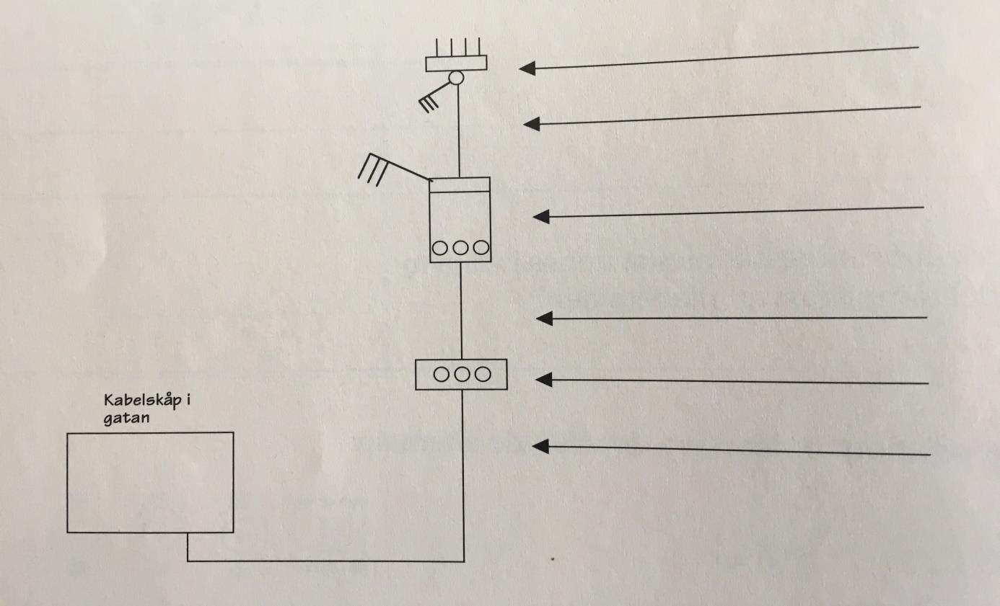

s. 24 i PDF:en

#### 151. Du har installerat en större central på en industri. Det bör finnas en betjäningsgång framför centralen. Hur bred bör den vara?

s. 25 i PDF:en

#### 152. Kondens kan uppstå i en kapslad central. Vilka två hjälpmedel kan monteras på centralen för att undvika kondens. Var ska de placeras?

s. 25 i PDF:en

#### 153. Flänsar benämns FL13, FL21 och FL33. FL betyder fläns men vilken information får du av siffrorna 13, 21 och 33?

s. 25 i PDF:en

#### 154. Vilken kabeltyp ska användas för inre förbindningar mellan huvudbrytare och säkringar i större centraler?

s. 25 i PDF:en

#### 155. Kablar får inte klämmas eller böjas för kraftigt. Isoleringen kan skadas. Vad kallas detta? Du hittar informationen i SS436 40 00.

s. 25 i PDF:en

#### 156. Vad kallas den skena som används för att montera fast dvärgbytare på?

s. 25 i PDF:en

## Faktabok kapitel 11 + Montörshandbok kapitel 2

#### 157. Anslut ledarna till centralerna nedan för rätt funktion

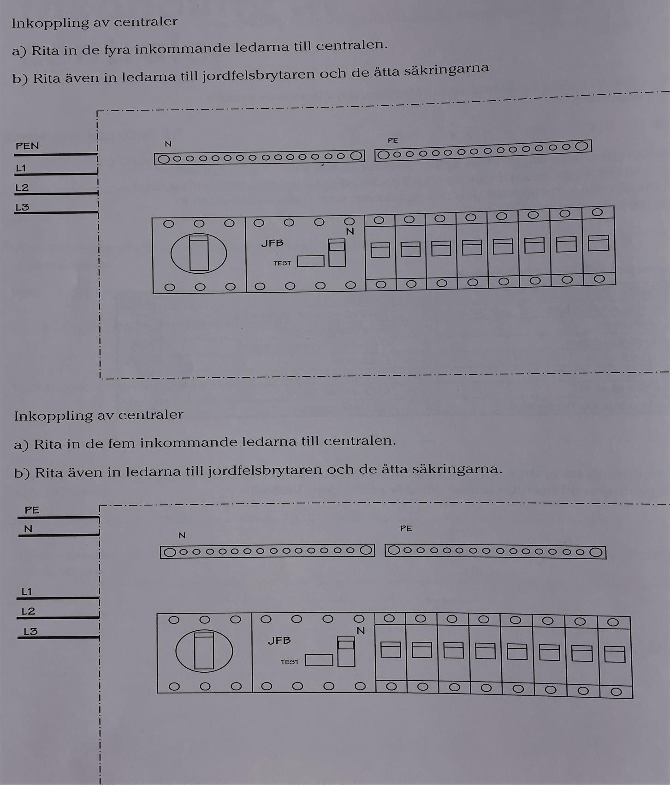

s. 26 i PDF:en

#### 158. Anslut nedanstående central Komplettera centralen med en gruppförteckning

- Radiatorer 16A kabelnummer.1
- Tvättmaskin 10A kabelnummer.2
- Frys 10A kabelnummer.3
- Kyl 10A kabelnummer.4
- Belysning 10A kabelnummer.5-7
- Anläggning Nacka Gymnasium
- Centrabeteckning B4

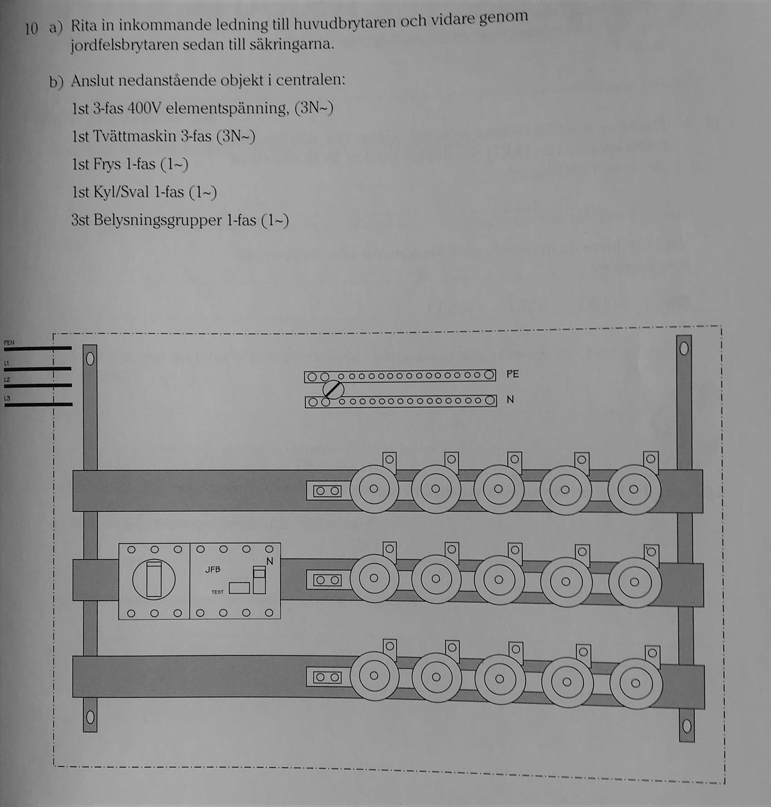

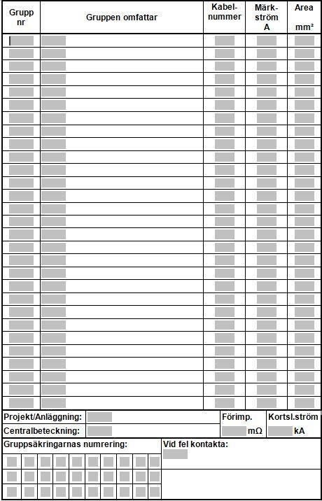

s. 26 i PDF:en

#### 159. Vad menas med begreppet sektionera en elinstallation?

s. 28 i PDF:en

#### 160. Du ska ansluta en aluminiumkabel i en central. Vilka fem moment bör du tänka på?

s. 28 i PDF:en

#### 161. Varför kan det vara värdefullt att montera in flera jordfelsbrytare i en villainstallation.

s. 28 i PDF:en

#### 162. Vad är läckströmmar för något?

s. 28 i PDF:en

#### 163. Vad är en personskyddsautomat för något?

s. 28 i PDF:en

#### 164. Ibland är inte PEN-ledaren grön/gul.

- Hur märker du den då?
- Vad menas med en koncentrisk ledare? Som finns i T.ex. EKKJ 4x6/6

s. 29 i PDF:en

#### 165. Ge exempel på två arbeten som kan räknas som heta arbeten

s. 29 i PDF:en

#### 166. Du ska göra ett hett arbete, då har du en mängd lagar och bestämmelser att rätta dig efter. Vilka?

s. 29 i PDF:en

#### 167. Vad gör man om det finns brännbart material i närheten av den plats där ett hett arbete ska utföras?

s. 29 i PDF:en

#### 168. Det finns 13 säkerhetsregler för den brandskyddsanvariga.

- Vilken säkerhetsregel behandlar ”Brandvakt”
- Vilken säkerhetsregel behandlar springor och hål

s. 29 i PDF:en

## Faktabok kapitel 12 + Montörshandbok kapitel 1

#### 169. I föreskrifterna skriver man om ”fuktiga utrymmen” och ”våta utrymmen”. Vad är skillnaden mellan dessa utrymmen?

- Var hittar du den informationen i SS 436 40 00?

s. 29 i PDF:en

#### 170. Får en handdukstork monteras i område 1 i ett badrum? Var hittar du den informationen i SS 436 40 00?

s. 29 i PDF:en

#### 171. En kund vill ha gamla väggmonterade armaturer han köpt på loppmarknad utomlands monterade i sitt badrum hemma. Ingen kappslinsklass eller CE märke finns angivet på armaturen. Vad säger du till kunden?

s. 29 i PDF:en

#### 172. Sök i någon materialkatalog:

- Finns det infällda strömbrytare med kapslingsklassen IP44?
- Ange två E-Nummer till en trappomkopplare med IP44

s. 30 i PDF:en

#### 173. Vi elinstallationer i lantbruk ställs det stora krav på det el material du väljer. Det finns många risker. Nämn två saker du skall tänka på. Var i SS 436 40 00 hittar du den informationen? Markera de alternativ som stämmer.

- 522
- 522.10.1
- 705.512.2
- 133.2
- 705

s. 30 i PDF:en

#### 174. Är det lämpligt att endast ha en jordfelsbrytare på byggarbetsplatser, eller bör det finnas flera? Motivera din åsikt.

s. 30 i PDF:en

#### 175. Det ska finnas ”förreglade intagsenheter” när det finns reservkraft i ett lantbruk. Vad menas med ”föreglade intagsenheter”? Var i SS 436 40 00 hittar du den informationen? Markera de rätta alternativen.

- 422.1
- 708.5.1.3
- 551.6.1

s. 30 i PDF:en

#### 176. Vid montering av ljusarmatur i lantbruk/djurstallar finns alltid en risk att armaturerna täcks av brännbart damm. Vilken typ av armatur skall man då använda och vilken symbol skall en sådan armatur vara märkt med? Var i SS 436 40 00 hittar du den informationen? Markera de rätta alternativen.

- 701.512
- 705.55.01
- 705.559

s. 30 i PDF:en

#### 177. Måste JFB installeras i lantbruks byggnader? Var i SS 436 40 00 hittar du den informationen?

s. 31 i PDF:en

## Faktabok kapitel 13 + Montörshandbok kapitel 3

#### 178. Servicecentralens namn är =A1

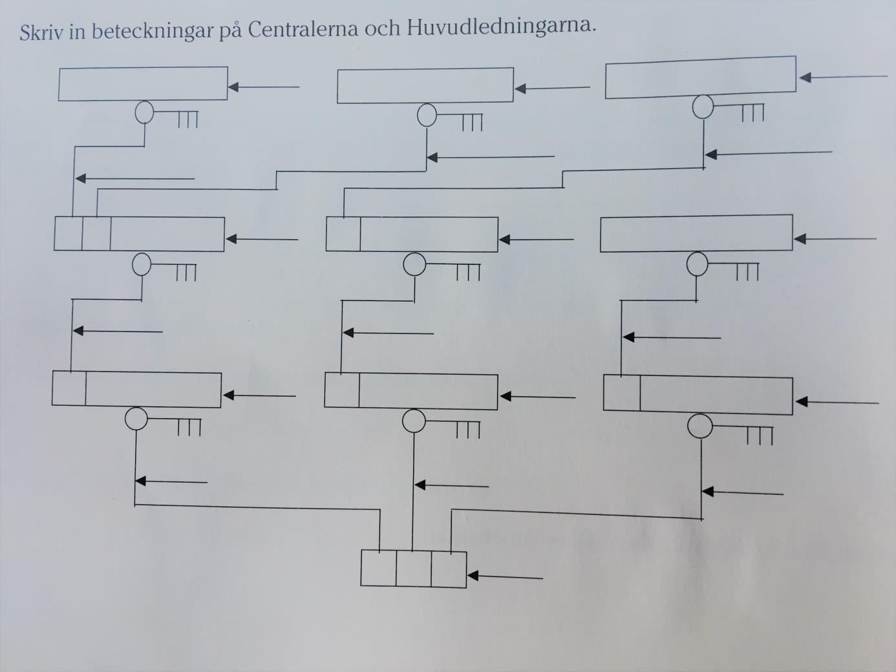

s. 31 i PDF:en

#### 179. I elbranschen används olika typer av begrepp. Vad innebär nedanstående begrepp?

- Innehavare
- Elektriker
- Elinstallatör

s. 31 i PDF:en

#### 180. På större elanläggningar är det viktigt att dokumentera sina arbeten ordentligt så att kunden senare kan hitta i anläggningen. Därför används kabelmärkningar och skyltar. Vilken information ska finnas med och ge ett exempel på en märkskylt för ett vägguttag och sätt ut kabelnummer på matningarna (bifogad ritning)

s. 32 i PDF:en

#### 181. När väl arbetet är klart på en större arbetsplats är det dags för besiktning. Vilka olika typer av besiktningar kan förekomma? Nämn minst tre stycken.

s. 32 i PDF:en

#### 182. I byggbranschen förekommer det en mängd olika förkortningar av olika slag. Vad betyder nedanstående förkortningar?

- UE
- TE
- BS

s. 32 i PDF:en

#### 183. Vad innebär begreppet nollnummer när vi pratar om kabelmärkning?

s. 32 i PDF:en

#### 184. Vad kan du utläsa av följande yttre märkning vid plint? 312_2_202

s. 32 i PDF:en

#### 185. Vad ska du tänka på när du upprättar en gruppförteckning om centralen du installerat innehåller en JFB?

s. 32 i PDF:en

#### 186. När du ska utforma ett strukturschema över en anläggning hör strukturerna ihop med en viss aspekt. Vad innebär dessa tecken?

- =
- +
- -

s. 32 i PDF:en

#### 187. Vid registrering används Objektslag och koder. Tex. Så är kabel objektet och koden för kabel är W. Vad har (se nedan) för kod?

- Kopplingsplint
- Likriktare
- Tidsrelä
- Lysrör
- Rökdetektor

s. 33 i PDF:en

#### 188. Hur gör man om man kommer till en installation där den äldre märkningstekniken har används? T.ex. röd jord

s. 33 i PDF:en

#### 189. Vad innebär utgåva 5 och utgåva 6? Du vill utöka och komplettera stativet nedan med två Paneler och två Switchar. Dom ska placeras under befintliga paneler. Vad kommer de att heta enligt nya & gamla registreringen?

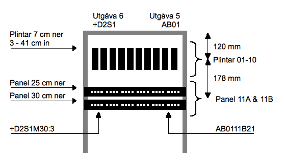

s. 33 i PDF:en

## Faktabok kapitel 14 + Montörshandbok kapitel 6

#### 190. Nämn fyra vanliga styrkomponenter för att styra belysning?

s. 34 i PDF:en

#### 191. Beskriv funktionen av:

- Kopplingsur
- Timer
- Trappautomat

s. 34 i PDF:en

#### 192. Vad är skillnaden mellan rörelsedetektor och närvarodetektor?

s. 34 i PDF:en

#### 193. Belysningsanläggningar kan ljusregleras på olika sätt. Nämn några.

s. 34 i PDF:en

#### 194. Är det lämpligt att montera en rörelsedetektor för att styra belysningen i ett kontorsrum? Motivera ditt svar.

s. 34 i PDF:en

#### 195. Kommunicerande system kan benämnas som ett ”öppet system” eller som ett ”Slutet system”. Vad är det för skillnad mellan dessa två system?

s. 34 i PDF:en

#### 196. Vilken spänning används för at styra ett HF-DON? Och vad står HF för?

s. 34 i PDF:en

#### 197. Rita ett styrkretsschema för en trapphusbelysning. Trapphuset består av 3 stycken armaturer och tre stycken tryckknappar som styr en trappautomat.

s. 34 i PDF:en

#### 198. Du ska installera belysning för en idrottsanläggning med en fotbollsplan. Fyra strålkastare på 3kW skall monteras och installeras. Anläggningen skall styras med hjälp av ett skymningsrelä, tidur och en 0-1-Auto brytare. I läge Auto ska anläggningen styras med hjälp av skymningsrelä. Rita upp ett styrkretsschema för anläggningen.

s. 34 i PDF:en

#### 199. Koppla in den här dosdimmern med en återfjädrande tryckknapp och en armatur.

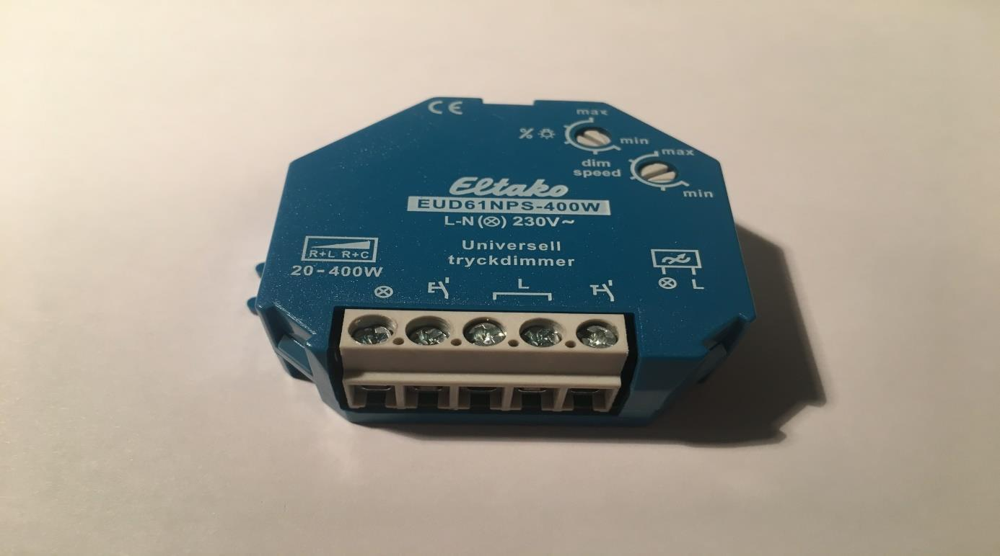

s. 35 i PDF:en

#### 200. Skriv in referensbeteckningar. Dvärgbrytare Överlastskydd Relä Manöverkopplare ( tryckknapp ) Signaldon ( lampa ) Kontaktor

s. 35 i PDF:en

#### 201. Rita styrkrets och huvudkrets över en fram/back kopplad motor. Ta med driftindikering för framåt och bakåt samt indikering för utlöst motorskydd. Styrkrets: Huvudkrets:

s. 35 i PDF:en

#### 202. a) Vad är det för apparat på bilden? b) På apparaten står det 230v, varför? c) Beskriv kontaktfunktion 1-2, 3-4 och 5-6. Vad är det för skillnad på dom jämfört med kontakt 13-14?

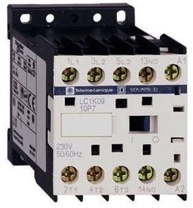

s. 36 i PDF:en

#### 203. Du har fått i uppdrag att koppla in ett spabad utomhus. Du kommer dra matningen från elcentralen i huset fram till badet. Kabeln kommer att klamras utomhus på fasaden och en kort bit ligga i rör i mark. Badet har följande specifikationer: Total anslutningseffekt: 5.6kw Spänning 400V Anslutning 2-fas, N, PE Räkna med cos 1 a) Räkna ut hur stor ström badet drar, visa formel och uträkning. c) Vilken kabel väljer du? Fullständigt namn med ledarantal och area. Välj exakt det ledarantal som behövs. Inga extra ledare.

s. 37 i PDF:en

#### 204. Rita ett schema över en belysningsanläggning med följande scenario: En lampa skall tändas automatiskt när det blir mörkt. Mellan kl. 23.00 – 06.00 skall belysningen vara släckt för att spara energi. Med en förbikopplare (strömbrytare) skall du kunna tända belysningen när som helst

s. 37 i PDF:en

## Faktabok kapitel 15 + Montörshandbok kapitel 6

#### 205. Det finns ett antal olika metoder som omvandlar elenergi till värme. De kan delas in i olika system. Vilka system?

s. 38 i PDF:en

#### 206. Elradiatorer kan delas in efter tre olika principer. Vilka?

s. 38 i PDF:en

#### 207. Du ska installera radiatorer i en förskola. Vad bör du tänka på angående radiatorns yttemperatur?

s. 38 i PDF:en

#### 208. En kund frågar dig om vilken golvvärme han skall använda på hela underplanet i hans villa. Vilka alternativ kan du ange? (även ej elektriska alternativ)

s. 38 i PDF:en

#### 209. Inkoppling av radiatorer. Installationen skall utföras som en infälld installation. uträkning.

- Anslut de tre radiatorernas plintar till en trefasgrupp: 10A, 400V, 1,5mm² kabel.
- Vilken är den högsta effekt som säkringen kan belastas med? Svara med formel och
- Varje radiator är på 600 Watt. Kommer säkringen att hålla?
- Var i rummet bör man montera upp en radiator?

s. 38 i PDF:en

#### 210. Kunden vill utöka sin anläggning, då kunden vill byta ut alla tre radiatorerna och lägga till 4 radiatorer. Dom nya radiatorerna har en effekt på 1000W /styck

- Kan du ansluta dem till denna gruppledning med bibehållen effekt?
- Vad kommer hända?
- Det finns två stycken sätt att lösa uppgiften. Vilka?

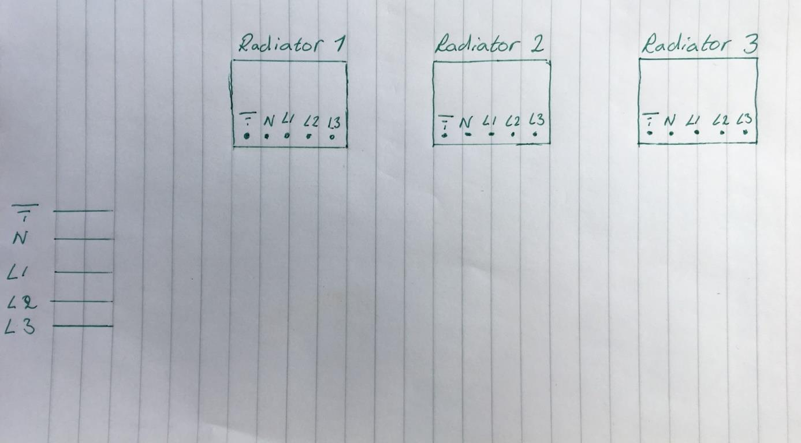

s. 39 i PDF:en

#### 211. Elradiatorer och golvvärme är två sätt att värma upp hemma. Men det finns fler sätt att värma både vatten och luft. Räkna upp dem nedan.

s. 39 i PDF:en

#### 212. En kund har köpt en elpanna som skall installeras. Då du läser leverantörsanvisningen märker du att pannans effekt överstiger mätarsäkringarnas ström. Vad har du för råd till kunden? Det finns två allternativ, beskriv båda.

s. 39 i PDF:en

#### 213. Vad innebär det att man energideklarerar en byggnad?

s. 40 i PDF:en

#### 214. Hur stor del av den globala energiproduktionen står belysningen för och vad kan göras för att minska den?

s. 40 i PDF:en

#### 215. Hur fungerar Bimetalltermostater? Och vad innebär det att man slav kopplar radiatorer?

s. 40 i PDF:en

#### 216. Nämn några användningsområden där värmekabel kan vara ett bra allternativ.

s. 40 i PDF:en

#### 217. Vad är en Elpatron? Och hur fungerar den?

s. 40 i PDF:en

#### 218. Du har fått i uppgift att installera en solcellsanläggning åt en villa kund. Vilka apparater behöver du till en sådan installation?

s. 40 i PDF:en

#### 219. Kunden blir väldigt nöjd med installationen. Så nöjd att han vill att du kopplar bort elleverantörens utgående matning från mätartavlan och hjälper han att avsluta abonnemanget. Vilket råd kan du ge kunden

s. 40 i PDF:en

## Elinstallationsreglerna SS 436 40 00

Besvara frågorna med din tolkning av regelverket och ange vilken punkt du hänvisar till. SS 436 40 00 är uppbyggd av 7 delar (t.ex. del 5), som innehåller kapitel (51), avsnitt (512) och punkter (512.2, 512.2.2).

#### B1. Dessa regler gäller för lågspänning. Var går spännings gränsen för lågspänning?

s. 41 i PDF:en

#### B2. Gäller dessa regler om du utökar en befintlig installation som är utförd innan dessa regler infördes dvs 2010?

s. 41 i PDF:en

#### B3. Får ett vägguttag placeras i bastu?

s. 41 i PDF:en

#### B4. Vilken kapslingsklass måste en utomhusbelysning på din tomt minst ha?

s. 41 i PDF:en

#### B5. Till vilken typ av utrymme klassas ett restaurangkök?

s. 41 i PDF:en

#### B6. Måste en elanläggning på lantbruk ha jordfelsbrytare?

s. 41 i PDF:en

#### B7. Vilken minsta area skall en PEN ledare ha och hur skall den märkas?

s. 41 i PDF:en

#### B8. Ett uttag skall placeras 1,7m upp på en ytterfasad. Vilken minsta kapslingsklass skall uttaget ha?

s. 41 i PDF:en

#### B9. Måste golvvärmeanläggningar ha jordfelsbrytare?

s. 41 i PDF:en

#### B10. Du skall installera ett vägguttag i ett duschrum. Hur långt ut från duschhuvudet måste uttaget placeras?

s. 42 i PDF:en

#### B11. Får du installera en handdukstork på väggen bredvid badkaret? Vad gäller då?

s. 42 i PDF:en

#### B12. Får en EXLQ grävas ned på tomten för att mata min utebelysning?

s. 42 i PDF:en

#### B13. Vilka byggnader / lokaler måste förses med jordfelsbrytare i Sverige?

s. 42 i PDF:en

#### B14. Får jag installera en armatur i tak i en bastu, vilka krav ställs iså fall?

s. 42 i PDF:en

#### B15. Får jag installera ett uttag för kylen (kall pilsner) i en bastu? Skötsel av elanläggningar, SS-EN 50 110-1 samt kap 7 i FA och kap 2 i MH.

s. 42 i PDF:en

#### B16. Nämn tre faktorer som påverkar kroppsskadans omfattning vid strömgenomgång?

s. 43 i PDF:en

#### B17. Hur beter du dig vid en elolycka om personen andas men är medvetslös?

s. 43 i PDF:en

#### B18. En elolycka har inträffat. Personen har ingen puls. Hur beter du dig?

s. 43 i PDF:en

#### B19. Gäller SS-EN 50110-1 även äldre anläggningar dvs anläggningar utförda innan Elinstallationsreglerna infördes ( retroaktivt )?

s. 43 i PDF:en

#### B20. Vilka spänningsnivåer gäller Skötselföreskrifterna för?

s. 43 i PDF:en

#### B21. Gäller denna standard för lekmän ( privatpersoner )?

s. 43 i PDF:en

#### B22. Vem är ansvarig för att en elanläggning underhålls på ett korrekt sätt?

s. 44 i PDF:en

#### B23. Vem utser eldriftledaren?

s. 44 i PDF:en

#### B24. Vem utser den elsäkerhetsledaren?

s. 44 i PDF:en

#### B25. Vilken uppgift har elsäkerhetsledaren?

s. 44 i PDF:en

#### B26. Skall elsäkerhetsledaren utses skriftligt eller räcker det att prata med personen ifråga?

s. 44 i PDF:en

#### B27. Kan en elmontör utses som elsäkerhetsledare?

s. 44 i PDF:en

#### B28. Måste elsäkerhetsledaren vara tillgänglig på arbetsplatsen?

s. 44 i PDF:en

#### B29. Vad är skillnaden mellan ”fortlöpande tillsyn” och ”periodisk tillsyn”?

s. 45 i PDF:en

#### B30. Vad skall man speciellt beakta vid fortlöpande tillsyn?

s. 45 i PDF:en

#### B31. Vissa anläggningar skall kontrolleras enligt fastställda tidsintervaller, t.ex. anläggningar som utsätts för extra stora påfrestningar. Ge tre exempel på sådana anläggningar?

s. 45 i PDF:en

#### B32. Vem ansvarar för att tillsyn respektive internkontroll utförs på elanläggningar?

s. 45 i PDF:en

#### B33. Vad bör man beakta när man bestämmer tidsintervallet på anläggningar ovan?

s. 45 i PDF:en

#### B34. Måste en periodisk tillsyn dokumenteras?

s. 46 i PDF:en

#### B35. Hur skall fel och brister som upptäcks vid en besiktning åtgärdas?

s. 46 i PDF:en

#### B36. Om du som elektriker utför ett arbete på en anläggning tex lantbruk. Du ser ett elektrisk fel / fara på den befintliga anläggningen. Vad skall du då göra?

s. 46 i PDF:en

#### B37. Normala skötselåtgärder anses ej vara elektriskt arbete i föreskriftens bemärkelse om de utförs på ett säkert sätt dvs så att fara ej uppstår. Vilka arbetsmoment ingår i normala skötselåtgärder?

s. 46 i PDF:en

#### B38. Hur säkerställer man att en anläggning är och förblir UTAN spänning ( 6 steg ) innan arbetet påbörjas? Specificera hur du utför respektive steg.

s. 46 i PDF:en

#### B39. Hur måste en därgbrytare = normsäkring vara märkt för att få användas som frånskiljare?

s. 47 i PDF:en

#### B40. När, hur och av vem ges tillstånd att påbörja ett arbete?

s. 47 i PDF:en

#### B41. Finns det något fall / anläggning där arbete MED spänning inte får förekomma?

s. 47 i PDF:en

#### B42. Vad skall elsäkerhetsledaren försäkra sig om innan arbetet MED spänning startar?

s. 47 i PDF:en

#### B43. Måste det finnas en elsäkerhetsledare inblandad när jag utför normala skötselåtgärder?

s. 48 i PDF:en

#### B44. Vilka tre arbetsmetoder används vid arbete MED spänning?

s. 48 i PDF:en

#### B45. Får en ensam person utföra ett arbete MED spänning?

s. 48 i PDF:en

#### B46. Hur är verktyg märkta som är avsedda för arbete med spänning?

s. 48 i PDF:en

#### B47. Vilka krav ställer standarden på en person som skall utföra ett arbete med spänning?

s. 48 i PDF:en

#### B48. Se bilaga A: Ange om arbetet är att betrakta som MED, NÄRA eller UTAN spänning? Systemspänning är 10KV, avstånd till spänningsförande del är 0,3m? Systemspänning är 400V, avstånd till spänningsförande del är 0,5m? Systemspänning är 110KV, avstånd till spänningsförande del är 1m? Systemspänning är 380KV, avstånd till spänningsförande del är 2m?

> **Obs:** Bilaga A saknas i PDF:en.

s. 48 i PDF:en

#### B49. Vilken person ger mig tillträde till ett driftrum om jag t.ex. skall läsa av elmätarna?

s. 49 i PDF:en

#### B50. Vilka krav ställs på en person som skall läsa av elmätare i ett driftrum? 51 Är avlägsnande av en centralkåpa för besiktning, mätning eller funktionskontroll att betrakta som arbete med spänning?

s. 49 i PDF:en

#### B51. Är utbyte av passdel ”bottenkontakt” att betrakta som arbete med spänning?

s. 50 i PDF:en

#### B52. Kräver föreskrifterna att man utser en elsäkerhetsledare vid normalt underhållsarbete?

s. 50 i PDF:en

#### B53. Vilka kompetenskrav gäller för personer som arbetar med underhållsarbete på en elanläggning?

s. 50 i PDF:en
